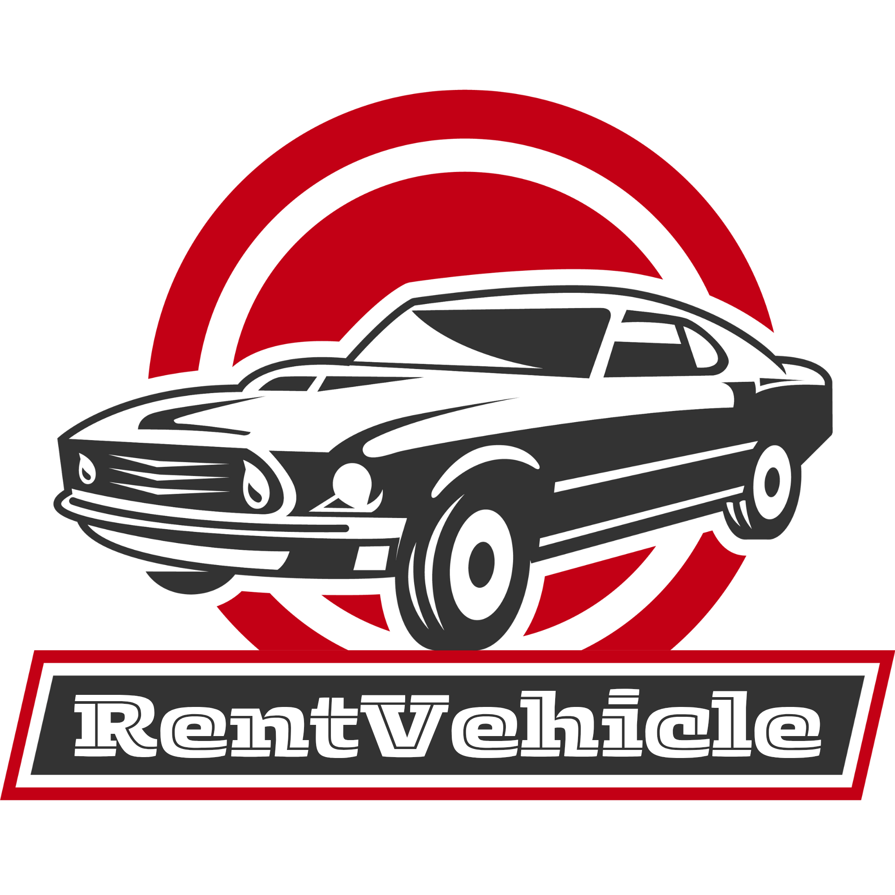
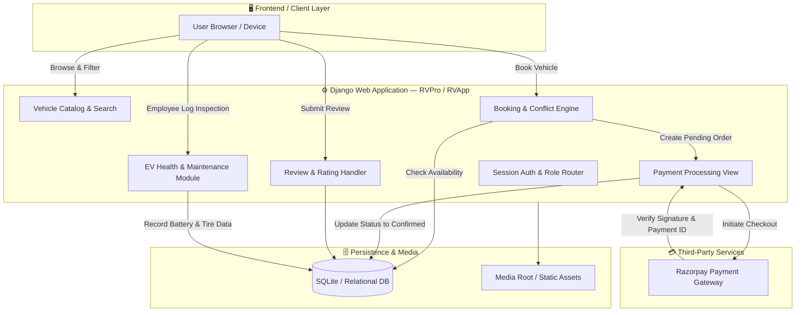

<div align="center">



<!-- Animated wave banner -->


<!-- Animated typing subtitle -->
<a href="#">
  
</a>

<br/>

<!-- Tech badges -->
<p>
  
  
  
  
  
</p>

<!-- Repo stats badges -->
<p>
  
  
  
  
  
</p>

<p align="center">
  <a href="#-key-features"><b>Key Features</b></a> ·
  <a href="#-system-architecture"><b>Architecture</b></a> ·
  <a href="#-tech-stack"><b>Tech Stack</b></a> ·
  <a href="#-quick-start--installation"><b>Quick Start</b></a> ·
  <a href="#-database-models"><b>Database</b></a> ·
  <a href="#-url-routing-reference"><b>Routes</b></a> ·
  <a href="#-user-roles--access-control"><b>Roles</b></a>
</p>

</div>


## 📖 Overview

**E-RentVehicle** is a full-stack Django web application engineered to accelerate the adoption of sustainable electric mobility. The platform provides a seamless self-service rental experience for customers and a specialized operations dashboard for fleet managers and technicians.

From real-time date-conflict validation and automated daily tariff calculation to **Razorpay online payments** and **EV battery health monitoring**, E-RentVehicle bridges the gap between everyday commuters and modern electric fleet administration.

<div align="center">

| ⚡ Zero-Emission Focus | 🔒 Secure Payments | 🛠️ Fleet Telemetry | 👥 Role-Based Access |
|:---:|:---:|:---:|:---:|
| EV-only inventory | Razorpay verified checkout | Battery, tire & brake logs | Customer / Employee / Admin |

</div>

---

## ✨ Key Features

<table>
<tr>
<td width="33%" valign="top">

### 🚗 Customers (Renters)
- **Interactive Fleet Catalog** — filter by class (SUV, Sedan, Crossover, Coupe, Hatchback) and seating capacity (4 / 5 / 7)
- **Vehicle Dossiers** — imagery, VIN, year, mileage, color, doors, per-day rate
- **Conflict-Free Reservations** — automated overlap validation on pickup/drop-off dates
- **Integrated Checkout** — Razorpay Payment Gateway with signature verification
- **Booking Portal** (`/my-bookings`) — track *Pending → Confirmed → Completed → Cancelled*
- **Verified Reviews** — 1–5 star ratings + written feedback
- **Password Recovery** — self-service reset

</td>
<td width="33%" valign="top">

### 🔧 Staff & Technicians
- **Gated Access** — approval required before login
- **Vehicle Onboarding** — add EVs with images, VIN, stock #, specs
- **EV Health Telemetry**
  - Battery health: Excellent / Good / Fair / Poor
  - Charging history & cycle logs
  - Brake condition & tire tread: New / Good / Worn / Replace
  - Odometer logging & inspection scheduling
- **Media Gallery** — upload showroom photography

</td>
<td width="33%" valign="top">

### 🛡️ Administrators
- **ID Verification** — review uploaded government ID before granting staff access
- **Full CRUD Oversight** — users, vehicles, maintenance logs, bookings, payments
- **Customer Inquiries** — manage contact-form submissions
- Access via Django Admin at `/admin/`

</td>
</tr>
</table>

---

## 🏗️ System Architecture



---

## 💻 Tech Stack

<div align="center">

| Domain | Technology | Purpose |
|:---|:---:|:---|
| **Backend Framework** |  | Business logic & ORM |
| **Language** |  | Core programming language |
| **Database** |  | Default DB (Postgres/MySQL ready) |
| **Payments** |  | Checkout, orders & verification |
| **Frontend** |    | ThemesFlat UI + FontAwesome |
| **Image Handling** |  | Upload processing & thumbnails |
| **Sessions** |  | Role-based auth (`User` vs `Employee`) |

</div>

---

## 📂 Project Structure

<details>
<summary><b>Click to expand full directory tree</b> 📁</summary>

```plaintext
RentVehicle-main/
│
├── RVPro/                       # Django Project Configuration
│   ├── settings.py              # Settings, Razorpay keys, media/static config
│   ├── urls.py                  # Master URL route dispatcher
│   ├── asgi.py / wsgi.py        # Deployment entry points
│
├── RVApp/                       # Core Application Module
│   ├── admin.py                 # Django admin customizations
│   ├── models.py                # DB schemas — Users, Cars, Bookings, Payments...
│   ├── views.py                 # Controllers & business logic
│   ├── migrations/               # Database migration history
│   ├── static/                  # CSS, JS, vendor assets, icons
│   └── templates/
│       ├── master_header.html   # Global nav & session switcher
│       ├── master_footer.html
│       ├── index.html           # Landing / hero showcase
│       ├── car-list.html        # Catalog with filters
│       ├── listing-details.html # Vehicle spec sheet
│       ├── booking.html         # Date selection & checkout
│       ├── my_bookings.html     # Reservation tracker
│       ├── leave_review.html    # Review submission
│       ├── Login_Register.html  # Auth modal
│       ├── addcart.html         # Vehicle onboarding (staff)
│       ├── Maintanace.html      # EV maintenance form (staff)
│       ├── gallery.html         # Public showcase
│       ├── addgallery.html      # Gallery upload
│       ├── contact-us.html
│       └── 404.html
│
├── media/                       # Uploaded files (git-ignored in prod)
│   ├── Cars/  ├── gallery/  ├── id_proofs/  └── logo/
│
├── db.sqlite3
├── manage.py
├── requirements.txt
└── README.md
```

</details>

---

## 🗄️ Database Models

```
 ┌──────────────────────┐         ┌──────────────────────┐
 │    registermodel     │1       *│     BookingModel     │
 ├──────────────────────┤◄────────┤──────────────────────┤
 │ u_name, u_email      │         │ rental_date          │
 │ u_phone, u_address   │         │ return_date          │
 │ role (User/Employee) │         │ pickup_loc, drop_loc │
 │ status (0=Unapproved)│         │ total_cost, status   │
 │ id_proof             │         └──────────┬───────────┘
 └──────────┬───────────┘                    │ 1
            │ 1                              │
            │ *                              │ 1
 ┌──────────▼───────────┐         ┌──────────▼───────────┐
 │   maintenancemodel   │         │       Payment        │
 ├──────────────────────┤         ├──────────────────────┤
 │ car_id (FK -> cars)  │         │ razorpay_order_id    │
 │ battery_health       │         │ razorpay_payment_id  │
 │ charging_history     │         │ amount, is_paid      │
 │ tire_condition       │         └──────────────────────┘
 │ brake_system         │
 └──────────────────────┘
            │ *
            │ 1
 ┌──────────▼───────────┐         ┌──────────────────────┐
 │         cars         │1       *│      feedReview      │
 ├──────────────────────┤◄────────┤──────────────────────┤
 │ v_name, make, seats  │         │ rating (1 to 5)      │
 │ vehicle_type, VIN    │         │ message, created_at  │
 │ price, doors, year   │         │ user_id, vehicle_id  │
 │ status, vehicle_image│         └──────────────────────┘
 └──────────────────────┘
```

---

## 🚀 Quick Start & Installation

> Follow along — each step builds on the last.

**1. Prerequisites**

  — plus a modern web browser.

**2. Clone the repository**
```bash
git clone https://github.com/AlokRana01/RentVehicle.git
cd RentVehicle
```

**3. Create & activate a virtual environment**

<table>
<tr><th>Windows (PowerShell)</th><th>Linux / macOS</th></tr>
<tr>
<td>

```powershell
python -m venv venv
.\venv\Scripts\Activate.ps1
```

</td>
<td>

```bash
python3 -m venv venv
source venv/bin/activate
```

</td>
</tr>
</table>

**4. Install dependencies**
```bash
pip install -r requirements.txt
```

**5. Set up Environment Variables**
Copy `.env.example` to `.env` and fill in your credentials:
* **Windows (PowerShell):**
  ```powershell
  Copy-Item .env.example .env
  ```
* **Linux / macOS:**
  ```bash
  cp .env.example .env
  ```
Configure your local secrets inside `.env`:
```env
SECRET_KEY=your-generated-django-secret-key
DEBUG=True
ALLOWED_HOSTS=127.0.0.1,localhost
RAZORPAY_KEY_ID=your-razorpay-test-key-id
RAZORPAY_KEY_SECRET=your-razorpay-test-key-secret
```

**6. Apply database migrations**
```bash
python manage.py makemigrations
python manage.py migrate
```

**7. Create a superuser (Admin Portal)**
```bash
python manage.py createsuperuser
```

**8. Run the development server**
```bash
python manage.py runserver
```

<div align="center">

| 🌐 Public Website | 🛠️ Admin Panel |
|:---:|:---:|
| `http://127.0.0.1:8000/` | `http://127.0.0.1:8000/admin/` |

</div>

---

## ⚙️ Configuration & Security Notes

### Environment Variables & Secrets
All secrets are strictly managed using environment variables via `python-dotenv`:
* **`SECRET_KEY`**: Never expose this key or commit it to GitHub. Generate a unique key for each deployment.
* **`DEBUG`**: Always set to `False` in production.
* **`ALLOWED_HOSTS`**: Specify exact hostnames/domains in production (e.g., `ALLOWED_HOSTS=rentvehicle.com,www.rentvehicle.com`).
* **`RAZORPAY_KEY_ID` & `RAZORPAY_KEY_SECRET`**: Generated in the [Razorpay Dashboard](https://dashboard.razorpay.com/app/keys). The secret key is strictly server-side and never exposed to client-side scripts.
* **Payment Security**: Payment completions are authenticated using Razorpay's cryptographic signature verification (`client.utility.verify_payment_signature`) on the server before reservations are confirmed.
* **Password Hashing**: User passwords are automatically hashed using Django's PBKDF2 algorithm (`make_password`) and never stored in plaintext.
* **Identity Documents**: Uploaded employee verification documents (`media/id_proofs/`) are excluded from version control to ensure user privacy and GDPR/compliance standards.

---

## 🔒 Production Readiness Checklist
When deploying to production environments:
- [ ] Set `DEBUG=False` in `.env`
- [ ] Set `ENABLE_SSL=True` to activate `SECURE_SSL_REDIRECT`, `SESSION_COOKIE_SECURE`, and `CSRF_COOKIE_SECURE`
- [ ] Configure a production WSGI/ASGI server (Gunicorn / Uvicorn) behind Nginx
- [ ] Switch database from SQLite to PostgreSQL / MySQL
- [ ] Set up persistent cloud media storage (e.g. AWS S3) for uploaded files

---

## 🚦 User Roles & Access Control

| Role | How to Register | Capabilities |
|:---|:---|:---|
| 🙋 **Customer** (`User`) | Self-signup via `/login_register_page` — instant activation | Browse vehicles · reserve dates · pay via Razorpay · manage bookings · submit reviews |
| 👷 **Employee** | Signup with ID proof upload — requires admin approval | Access staff menu · add vehicles · log EV maintenance · upload gallery images |
| 🛡️ **Administrator** | Created via `python manage.py createsuperuser` | Full `/admin/` access · approve employees (`status = 1`) · oversee all data |

---

## 🗺️ URL Routing Reference

<details>
<summary><b>Click to expand the full route table</b> 🔗</summary>

| Endpoint | Method | View Function | Description |
|:---|:---:|:---|:---|
| `/` or `/index_page` | GET | `index_page` | Homepage, hero section, featured EVs |
| `/car_list_page` | GET | `car_list_page` | Browse fleet with filters |
| `/single_car/<id>` | GET | `single_car` | Detailed spec page |
| `/booking/<bookid>` | GET | `booking` | Initiate reservation |
| `/book_car` | POST | `book_car_view` | Date clash validation & booking creation |
| `/my-bookings` | GET | `my_bookings_view` | Bookings list + Razorpay trigger |
| `/payment-success` | POST | `payment_success` | Verifies transaction, confirms reservation |
| `/review/<booking_id>/` | GET/POST | `leave_review` | Post-rental rating & feedback |
| `/login_register_page` | GET | `login_register_page` | Unified auth interface |
| `/fetchregister` | POST | `fetchregister` | New user/employee registration |
| `/login` | POST | `login` | Credential validation & session init |
| `/logout` | GET | `logout` | Terminates session |
| `/maintain_page` | GET | `maintain_page` | Employee EV maintenance dashboard |
| `/fetchmaintanancedata` | POST | `fetchmaintanancedata` | Saves battery/inspection records |
| `/add_car_page` | GET | `add_car_page` | Vehicle onboarding form |
| `/fetchvehicledata` | POST | `fetchvehicledata` | Processes new vehicle submissions |
| `/cargallery` | GET | `cargallery` | Public photo gallery |
| `/fetchgallery` | GET | `fetchgallery` | Gallery upload interface |
| `/contact_page` | GET | `contact_page` | Contact-us inquiry form |
| `/reset_password` | POST | `reset_password` | Resets password by registered email |
| `/admin/` | ALL | `admin.site.urls` | Django admin portal |

</details>

---

## 🔮 Future Roadmap

- [ ] **IoT Telemetry Integration** — real-time OBD-II and battery BMS streaming
- [ ] **GPS Live Tracking** — in-app vehicle location during active rentals
- [ ] **SMS / WhatsApp Alerts** — booking confirmations & reminders via Twilio
- [ ] **EV Charging Station Locator** — embedded map of nearby fast-chargers
- [ ] **Mobile Application** — Flutter or React Native cross-platform client

---

## 🤝 Contributing

Contributions make the open-source community amazing. Any contribution is **greatly appreciated**!

```bash
# 1. Fork the project
# 2. Create your feature branch
git checkout -b feature/AmazingFeature

# 3. Commit your changes
git commit -m "Add some AmazingFeature"

# 4. Push to the branch
git push origin feature/AmazingFeature

# 5. Open a Pull Request
```

---

## 📄 License

Distributed under the **MIT License**. See [`LICENSE`](LICENSE) for details.

---

## 👨‍💻 Author & Acknowledgments

<div align="center">

**Alok Rana** — *Project Creator & Developer*

[](https://github.com/AlokRana01)

Developed as a College Capstone Project dedicated to sustainable urban transportation and smart electric vehicle fleet management.

<br/>


<sub>Built with ❤️ using Python & Django</sub>

</div>